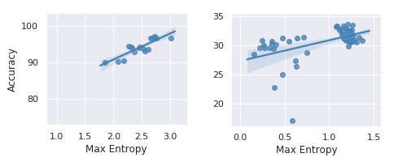
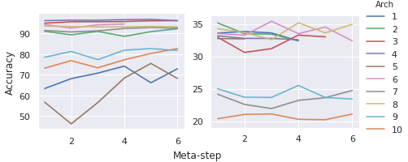

# self-organizing
Research into self organizing hierarchies for artificial neural networks.

## Key highlights
- Accepted at AJCAI 2020. [[paper](https://github.com/satyaborg/self-organizing/tree/master/paper/self_organising_neural_network_hierarchy.pdf)]
- Accepted at NAISys 2020 for poster presentation. [[poster](https://meetings.cshl.edu/posters/naisys20/images/viewer.html?file=naisys_20_58.pdf)]

## Installation

To install the dependencies and train, execute the following:
```
virtualenv -p python3 venv
source venv/bin/activate
chmod +x train.sh 
./train.sh
```

> Note: All arguments and hyperparameters to the program can be modified under the `config.yaml` file.

## Results

- Accuracy vs Max Entropy (global)


- Accuracy vs Meta-steps


<!-- |Units|Arch|Meta-steps|Accuracy|
|----|----|----|----|
|3|Pyramidal|20|92.5| -->

## TODO

- [x] Refactor the training of handcrafted architectures 
- [x] Handle both single and multi-channel inputs (CIFAR10)
- [x] Add code profiler
- [x] Refactor the meta-learner: Simulated Annealing